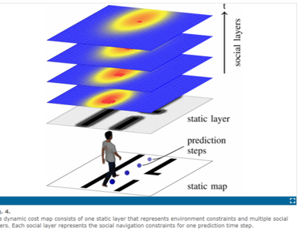
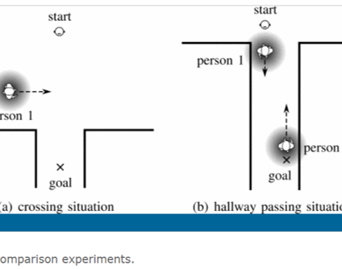
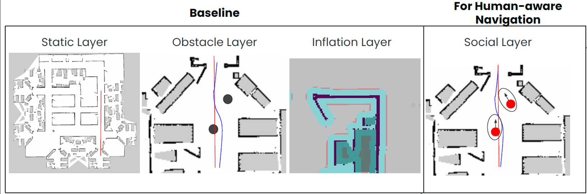
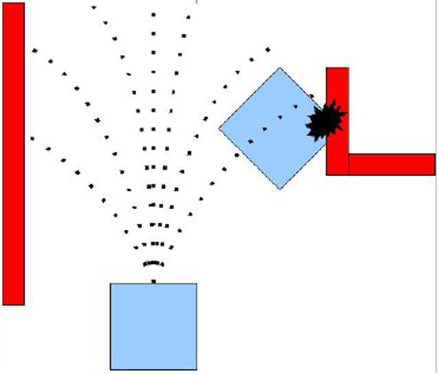
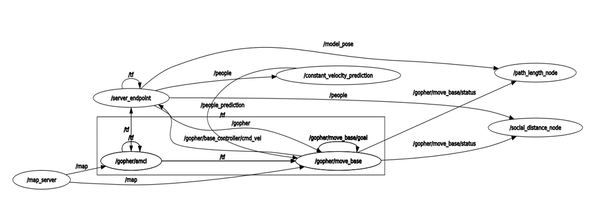

# Social-Navigation
This project implements various Global Planners like A*, Dijkstra's, and Lattice Planner. It also includes various Local Planners such as DWA, TEB, and Timed path planner for dynamic obstacle avoidance. The performance of the implemented planners are compared with each other.

## Project Explanation - Part 1

## Project Explanation - Part 2

## Instructions on how to run our project

### Step 1
Please create a new workspace and place our code in the Src of your workspace. Please make sure that you are not sourcing any workspace in the bash script. If so, please comment that part.

### Step 2
Please run the command `ifconfig` in your terminal and note down the IP Address of your computer.

### Step 3
Make sure you update the IP Address in ROS settings and ROS communication plugins in Unity.

### Step 4
Navigate inside the Src—>Gopher-ROS-Unity—>Gopher-Unity-endpoint—>Launch. Please update the IP address in the below 3 launch files:
- gopher_presence_server_baseline.launch
- gopher_presence_server_Soc.launch
- gopher_presence_server_dwa.launch

**Please look at the 4th line and change the default IP Address to your IP Address**

### Step 5
Once you have successfully changed the IP address, make sure that a connection is established between ROS(Noetic) and Unity 3D. The indication is there will be a blue light blinking in the game window. Once the connection is established, please use the following commands to launch different pair of algorithms:
- For baseline approach:
  `roslaunch gopher_unity_endpoint gopher_presence_server_baseline.launch`
- For Social Navigation Approach:
  `roslaunch gopher_unity_endpoint gopher_presence_server_Soc.launch`
- For A* and DWA approach:
  `roslaunch gopher_unity_endpoint gopher_presence_server_dwa.launch`

### Step 6
Localize the robot by clicking on the green arrow and you will be able to see the pose array.

### Step 7
Once the Robot is localized, give a goal pose in the mapped region by clicking on 2DNavGoal (violet color).

### Step 8
Please choose appropriate topics for paths generated.

### Step 9
By now you would be able to see the robot moving in the hospital environment.

### Step 10
Have fun experimenting!

(Note: GitHub might not display .emf files correctly)

